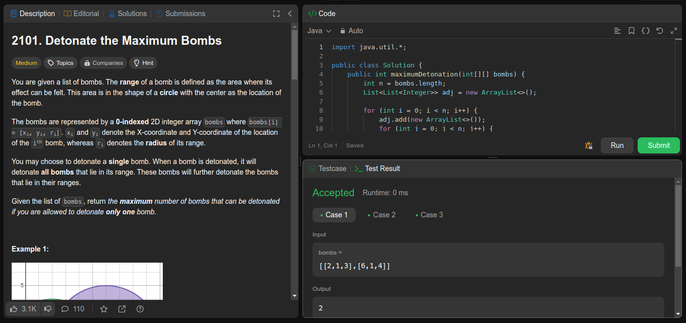
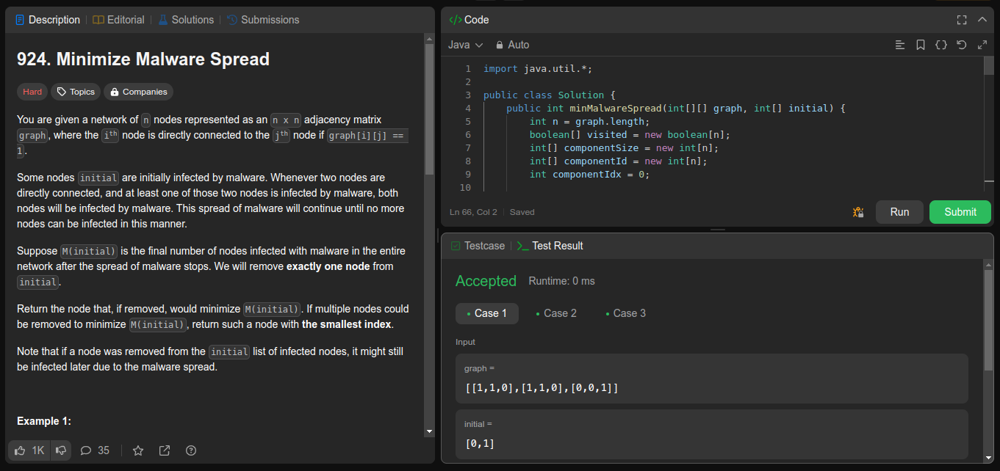
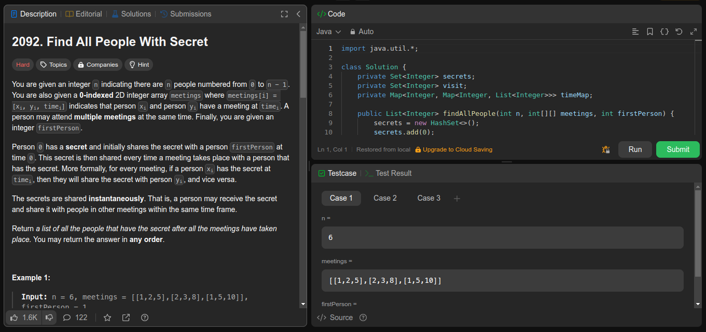

# NomedoProjeto

**Número da Lista**: 17 
**Conteúdo da Disciplina**: Grafos1 

## Alunos
|Matrícula | Aluno |
| -- | -- |
| 21/1030700  |  Chaydson Ferreira da Aparecida |
| 21/1030676  |  Ana Luíza Rodrigues da Silva |

## Sobre 
Apresentação da resolução de três problemas da plataforma LeetCode aplicando os conceitos de grafos aprendidos em sala. 

Problemas
| Código | Nome | Dificuldade |
| ------------------ | ---------------- | ----------- |
| 2101 | [Detonate the Maximum Bombs](https://leetcode.com/problems/detonate-the-maximum-bombs/description/) | Médio |
| 924 | [Minimize Malware Spread](https://leetcode.com/problems/minimize-malware-spread/description/) | Difícil |
| 2092 | [Find All People With Secret](https://leetcode.com/problems/find-all-people-with-secret/description/) | Difícil |

## Screenshots

O funcionamento das soluções pode ser visto nas imagens 1, 2 e 3.

    
    <i>Imagem 1: Submissão da questão 2101 (LeetCode)</i>

    
    <i>Imagem 2: Submissão da questão 924 (LeetCode)</i>

    
    <i>Imagem 3: Submissão da questão 2092 (LeetCode)</i>

## Linguagem 
Java

## Uso 
Os códigos devem ser executados na plataforma [LeetCode](https://leetcode.com/).

## Vídeo de apresentação do trabalho
O vídeo de apresentação encontra-se neste [link](https://youtu.be/zciG45uM-eY)
